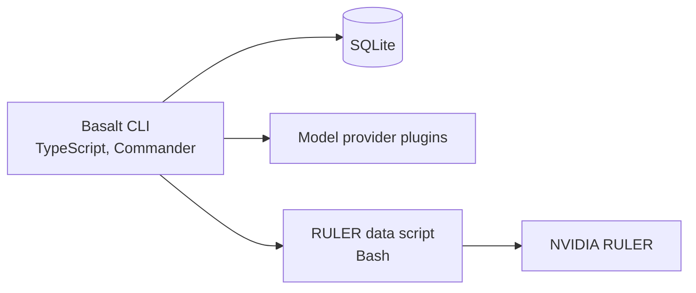

# Basalt

Basalt is a command-line agent harness, similar to Claude Code, built as a TypeScript pnpm and Turborepo monorepo. It runs agent sessions against model providers loaded as plugins from its state directory, stores sessions in SQLite, keeps credentials in an encrypted local secret store, and includes a RULER-based long-context evaluation pipeline.

